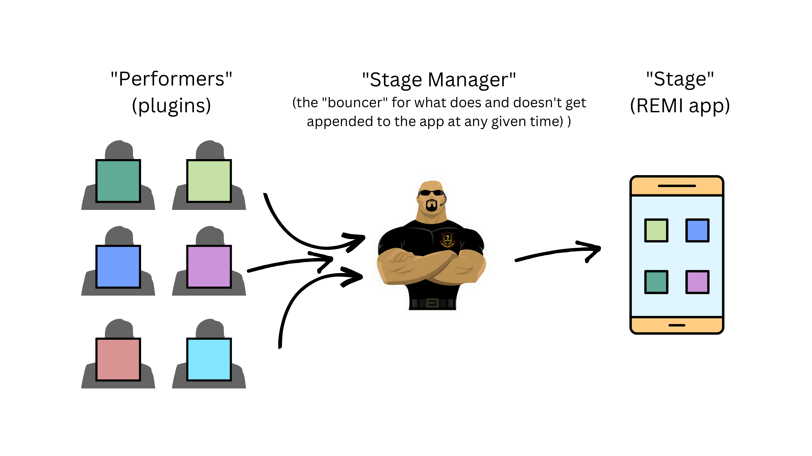
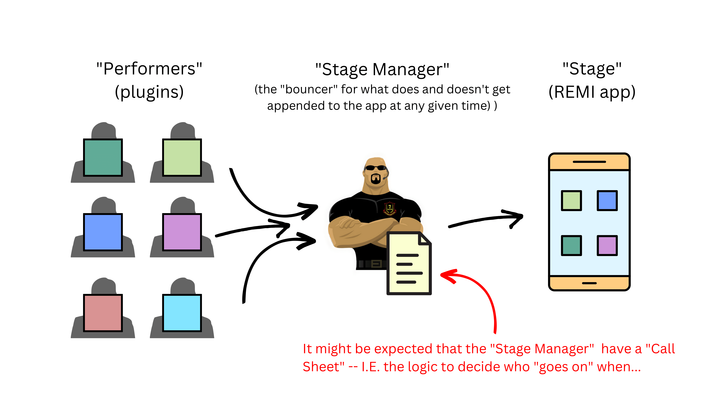
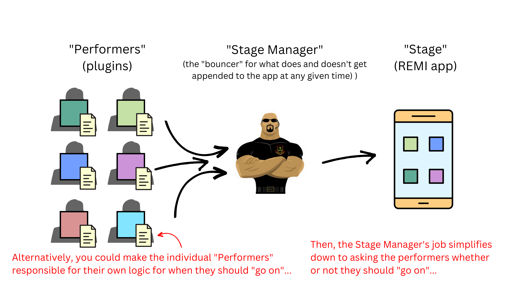
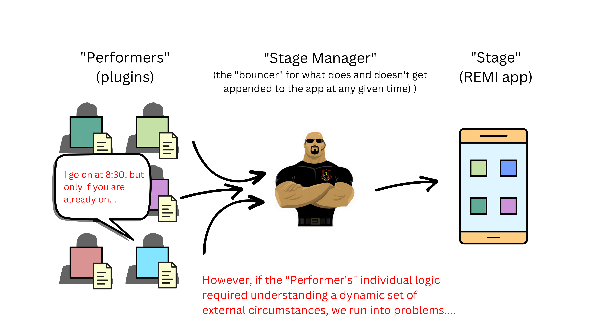

# 🚀 README.md

## ❓ About

This repo currently exists to help me test and plan the theory behind the "kiosk-style" app that I will run on my raspberry pi and use to accomplish a variety of tasks including but not limited to:

- entertainment (limited watching of videos, etc.)
- controlling mechanical devices such as a lockbox for downtime from electronics
- other interactive sub-apps such as: computer-vision-monitored physical exercise, personal study tools like flashcards, etc.


## 📈 Current Goal

Come up with a way to effectively modularize sub-apps such that:

1. They are self-contained
2. They are self-governed
3. My main app code does not need to know anything about them.

## 📉 Current Status

I have successfully written an app structure that seems to accomplish the current goal.

However, I would like to improve the code/strategy/design pattern to the extent possible.

## 💻 Running the app

- Clone the repo
- Navigate to the repo directory
- Create the necessary Python virtual environment using the `Makefile` commands:

```bash
make venv
make activate
make install
```

- Run the app with either of the following commands:

```bash
python3 app.py
```

or

```bash
make run
```

## 💃🏯 Theater Analogy

The app is currently written with naming that corresponds to the following analogy:






